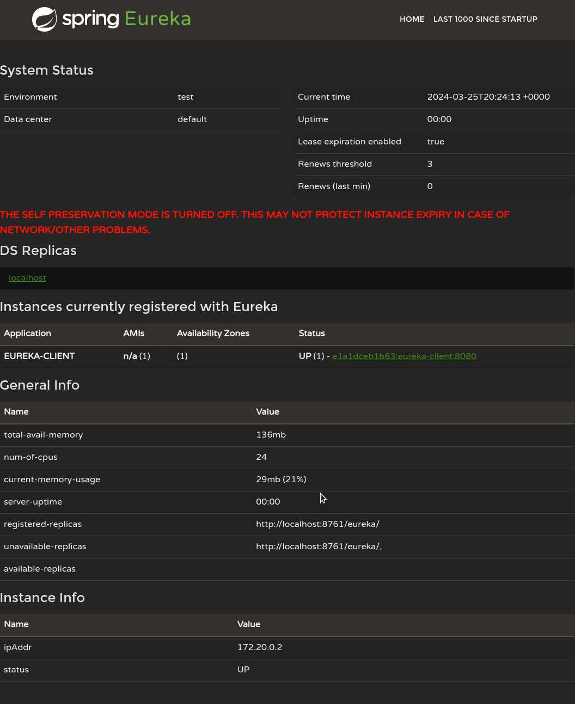

# Eureka service discovery 
An example for implementing [client side service discovery pattern](https://microservices.io/patterns/client-side-discovery.html) using the  [Eureka service from Netflix OSS](https://cloud.spring.io/spring-cloud-netflix/reference/html/).

Before the application can be started the following checks need to be done:

## How to
### 1. Clone the application
Clone the repository
```bash
git clone <repo>
```
#### 2. Build the application (optional)
The application will be automatically built if `docker-compose` is used. But if we wish to do a local build, we need to first install the dependencies. The following command needs to be run inside both directories i.e. `eureka-client` and `eureka-server`.
```bash
./mvnw clean install
```
Then we build the package
```bash
./mvnw -V -B -DskipTests clean package verify
```
#### 3. Run the application
For the `eureka-client` application there are two spring profiles `default` and `docker`. The `docker` profile is configured to use the services run via `docker-compose`. If we wish to use the `docker` profile (the easier approach), we can refer the `docker-compose.yml`. For using the docker profile we can simply run:
```bash
docker-compose up -d
```
#### 3a. Run the application locally
For the `default` spring profile we need to individually start both `eureka-client` and `eureka-server`. The following command needs to be run inside both directories i.e. `eureka-client` and `eureka-server`:
```bash
./mvnw spring-boot:run 
```

#### 4. Test the application

##### 4a. Health Checks
Both the `eureka-client` and `eureka-server` have been configured to use the actuator endpoints like `/health` & `/info`. E.g. to check the status of the `eureka-server` we can run:
```bash
curl -m 5 -fs -X GET http://localhost:8761/actuator/health
```

##### 4b. Server APIs
The Web UI for Eureka server should be available at `http://localhost:8761`. Below is a screenshot: 
.

The other endpoints for the `eureka-server` API are described [here](https://github.com/Netflix/eureka/wiki/Eureka-REST-operations).

#### 5. Stop the application
- If the applications was started via `docker-compose` then it can be stopped using.
```bash
docker-compose down
```
In case the volumes need to be removed we can use:
```bash
docker-compose down --volumes
```
- If the application was started locally please ensure the datasource is stopped after stopping the application.

